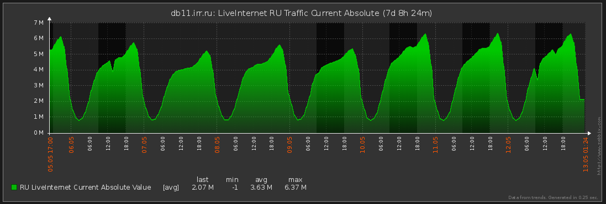

Данный скрипт позволяет парсить картинки LiveInternet графиков и выдавать численные значения линий с них, это можно использовать для формализации значений и использования из в системах мониторинга (например, забикс)

Параметры запуска такие:
обязательные:
1) {irr,jobru,ru} # аккаунт
2) {last-day,last-week} # действие
3) {get-diff,get-absolute} # режим
4) --password PASSWORD # пароль от аккаунта
необязательные:
1) --help # справка
2) --debug # отладка, показывает стектрейсы в случае ошибок 

первый аргумент - задаем логин в liveinternet 
второй аргумент - выбираем режим графика (есть график где сравнивается текущий график с предыдущим днем, а есть где сравнивается с прошлой неделей и средним за 7 дней) 
третий аргумент - либо нужно получить разницу с предыдущим днем (или прошлой неделей, в зависимости от предыдущего режима), либо получить абсолютное значение, которые вычисляется исходя из максимального значения шкалы Y (разбирается системной утилитой gocr, нужно ставить из репозиториев)
параметр --password задает пароль для введенного аккаунта
параметр --debug выводит stacktrace в случае ошибки (полезно для отладки)

скрипт на на выходе выдает обычное число, которое можно рисовать в забиксе (или реагировать как либо еще, как угодно), либо -1, что можно использовать для обнаружения ошибок в работе скрипта

Результат нас полностью устроил, используем для быстрого реагирования на изменение объема трафика в LiveInternet: 

 
